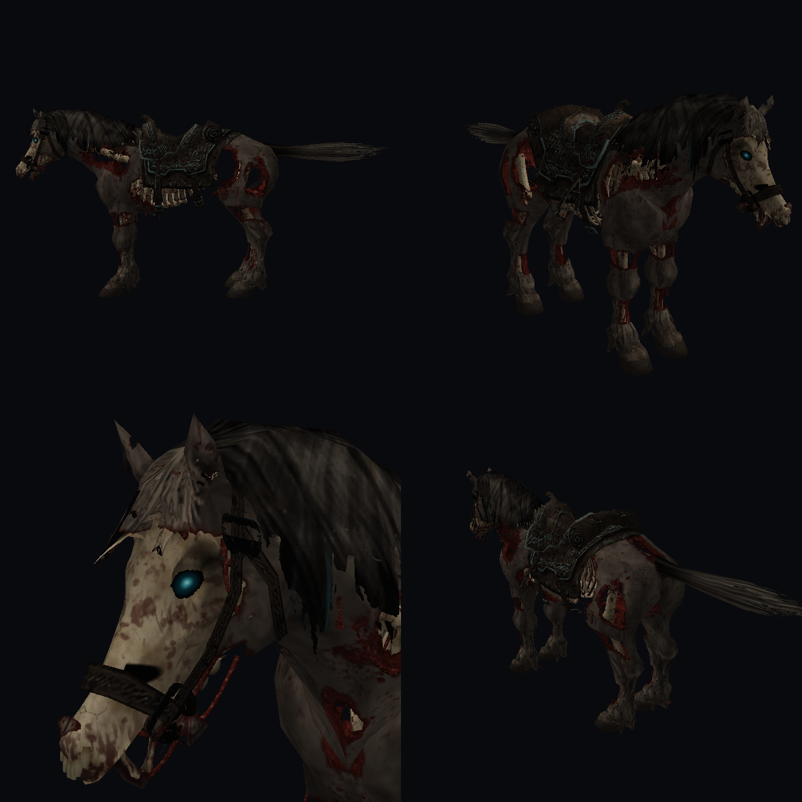

# Nightwalker Epona

Undead Epona for [Dusklight](https://github.com/TwilitRealm/dusklight), the Twilight Princess PC port.



A full model replacement for Epona. It keeps her original rig, so every animation works as normal:
walking, galloping, jumping, rearing, and the jaw moving when she neighs. Link rides her the same way,
and the saddle and reins are unchanged.

## Install

1. Download `com.i12bp8.nightwalker_epona.dusk` from [Releases](../../releases).
2. Drop it on the Dusklight window, or copy it into your mods folder:
   - Windows: `%APPDATA%\TwilitRealm\Dusklight\mods`
   - Linux: `~/.local/share/TwilitRealm/Dusklight/mods`
   - macOS: `~/Library/Application Support/TwilitRealm/Dusklight/mods`
3. Enable it in the **Mods** menu and change area (or restart) so Epona reloads.

Leave the Cosmetics mod's *Epona color* option on default. It recolors her textures at runtime and
overrides the HD textures.

## Building from source

The repo only contains the tools. Game data is extracted from your own copy of the game, and none of
it is included here.

Requirements: Python 3.11+ with `numpy pillow scipy xxhash` (`oead` is optional and speeds up
extraction), plus [nodtool](https://github.com/encounter/nod) to unpack a disc image.

```sh
nodtool extract "Twilight Princess (USA).rvz" disc
python tools/extract.py disc
python tools/build.py            # add --install to copy it into Dusklight's mods folder
```

The output is written to `dist/`, with preview renders in `previews/`.

| File | Purpose |
| --- | --- |
| `tools/build_model.py` | Assembles the new `hs.bmd` on top of the original rig |
| `tools/skeleton.py` | Bone geometry |
| `tools/paint_wight.py` | Texture painting |
| `tools/bmd.py`, `bmdwrite.py`, `gctex.py` | J3D model reader/writer and GX texture codecs |
| `tools/anim.py`, `render.py` | Animation posing and a software renderer for previews |

## Credits

Made by i12bp8. Thanks to the Dusklight team and the zeldaret decompilation project.

Twilight Princess and Epona belong to Nintendo. This is a fan project and is not affiliated with Nintendo.
